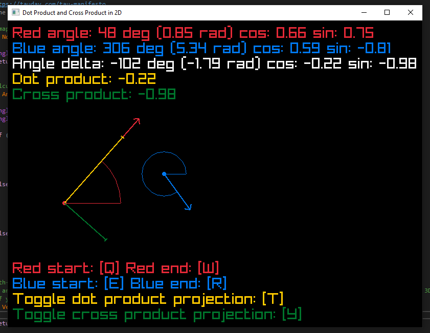

# Dot Product and Cross Product in 2D

Interactive visualization of dot and cross product in [raylib](https://www.raylib.com/). Shows how dot product corresponds to cosine, how cross product corresponds to sine, and how they can be used to project a vector onto a normal.

Using CMake to build is optional, but a default raylib CMakeLists example is included.